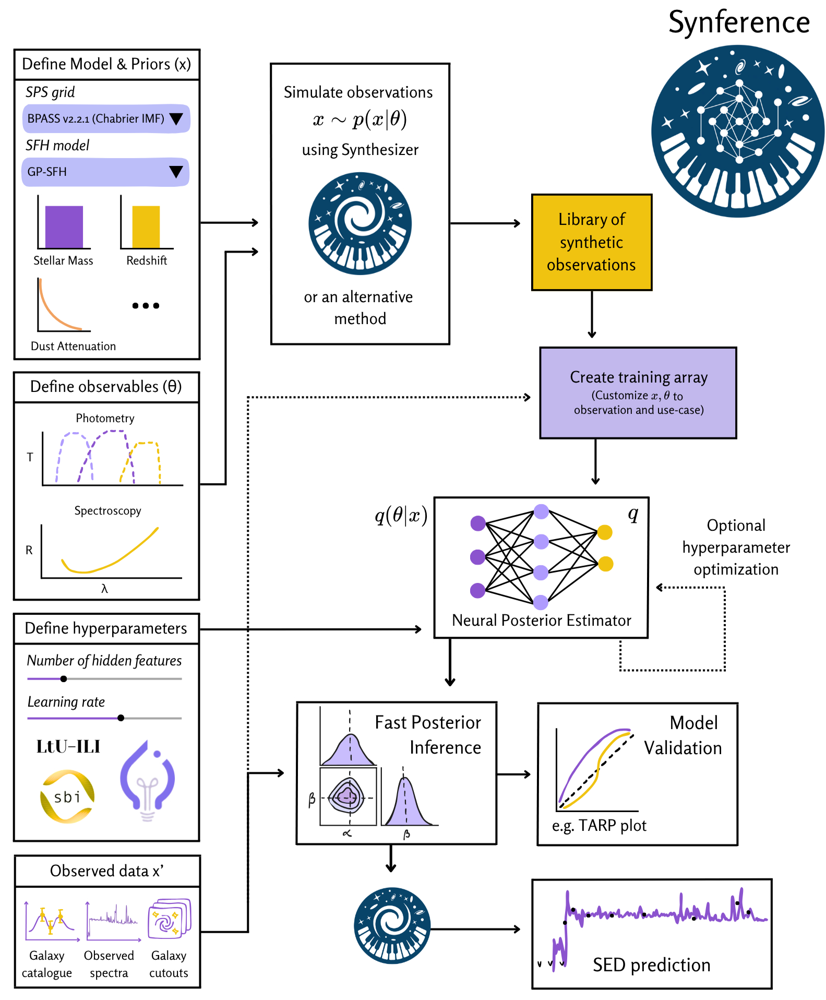

Overview
*********

The aim of Synference is to provide a flexible, modular, and user-friendly framework for performing SBI-based SED fitting. Synference leverages the `Synthesizer <https://github.com/synthesizer-project/synthesizer>`_ package to generate synthetic observables and the `LtU-ILI <https://github.com/maho3/ltu-ili>`_ package to perform fast, amortized posterior inference.

Structure
^^^^^^^^^

The Synference package is split into two main components:

- **Library Generation:** Tools to generate libraries of synthetic observables using the Synthesizer package.
- **SBI Training and Inference:** Tools to train SBI models using the LtU-ILI package, and to perform posterior inference on observed data.

The flowchart below illustrates how the different components of Synference, such as defining observables and creating training arrays, interact:

