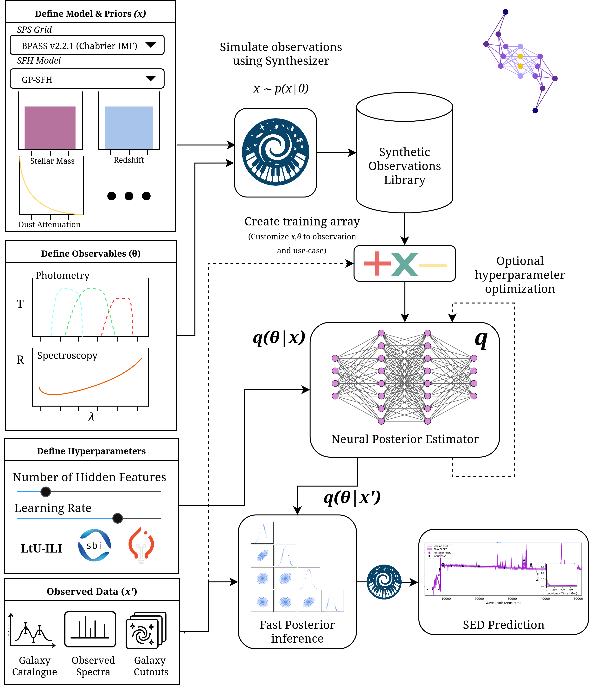

Overview
*********

The aim of Synference is to provide a flexible, modular, and user-friendly framework for performing SBI-based SED fitting. Synference is built on top of the Synthesizer package for generating synthetic observables, and the LtU-ILI package for fast, amortised posterior inference.

Structure
^^^^^^^^^

The synference package is split into two main components:
- **Library Generation**: Tools to generate libraries of synthetic observables using the Synthesizer package.
- **SBI Training and Inference:** Tools to train SBI models using the LtU-ILI package, and to perform posterior inference on observed data.

This flowchart illustrates how the different components of synference interact:

